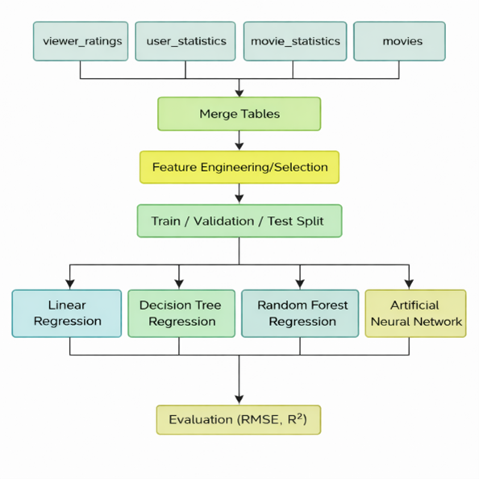
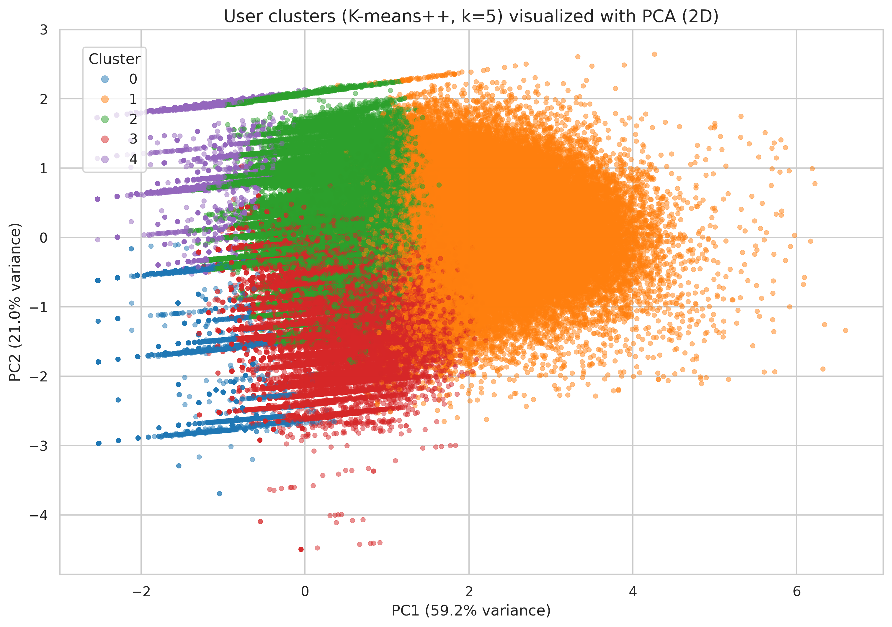
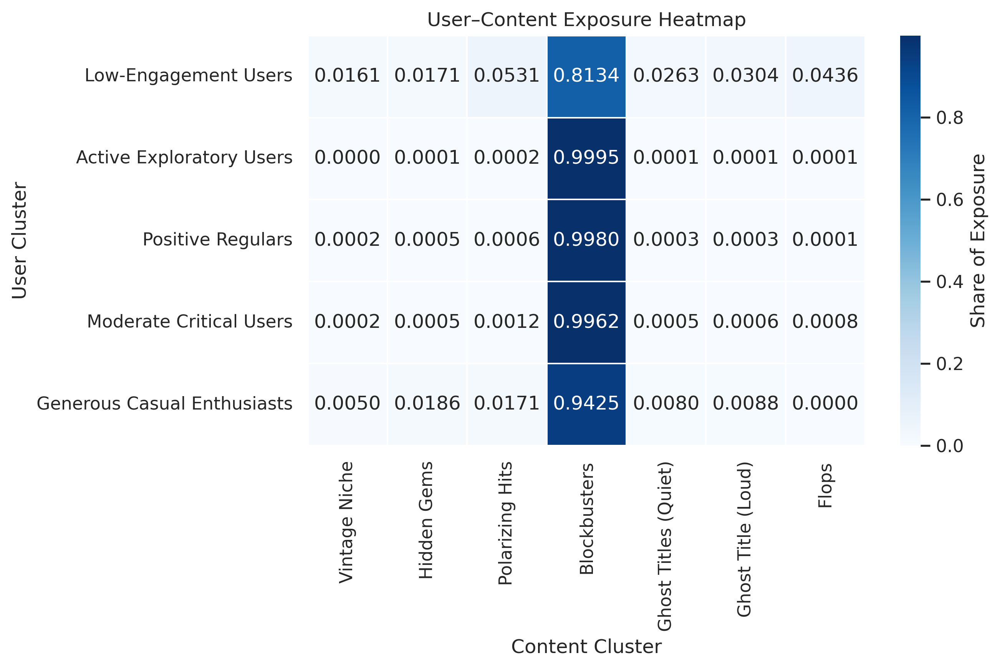
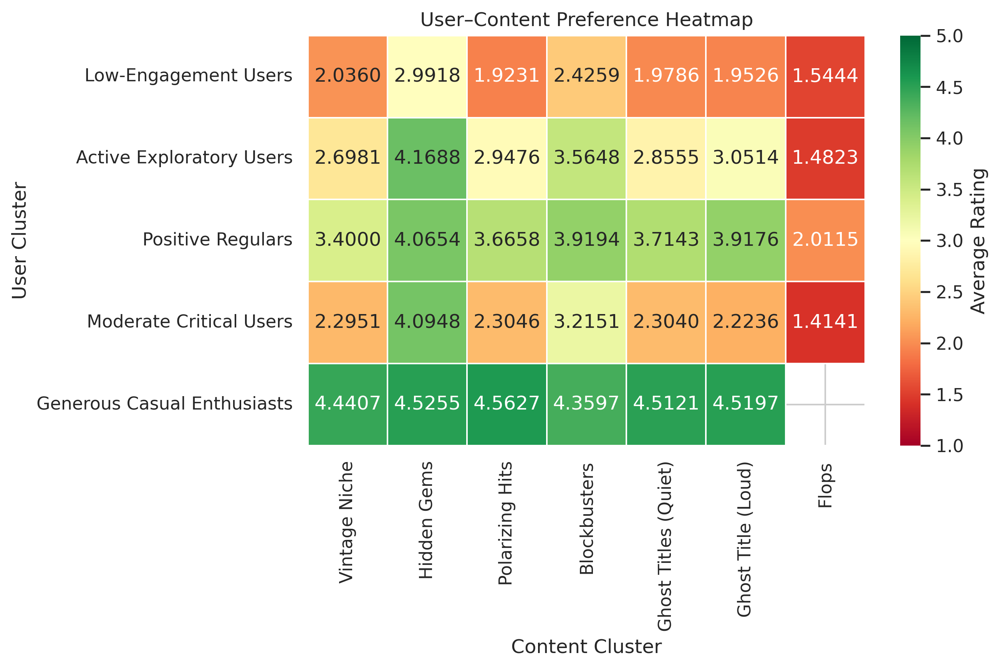
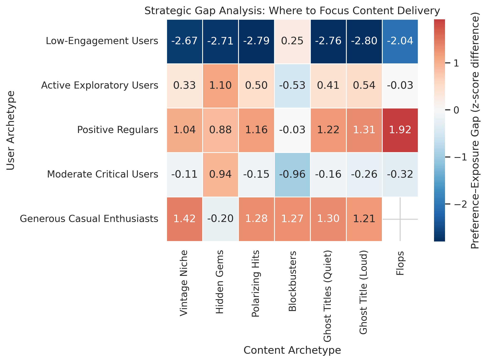
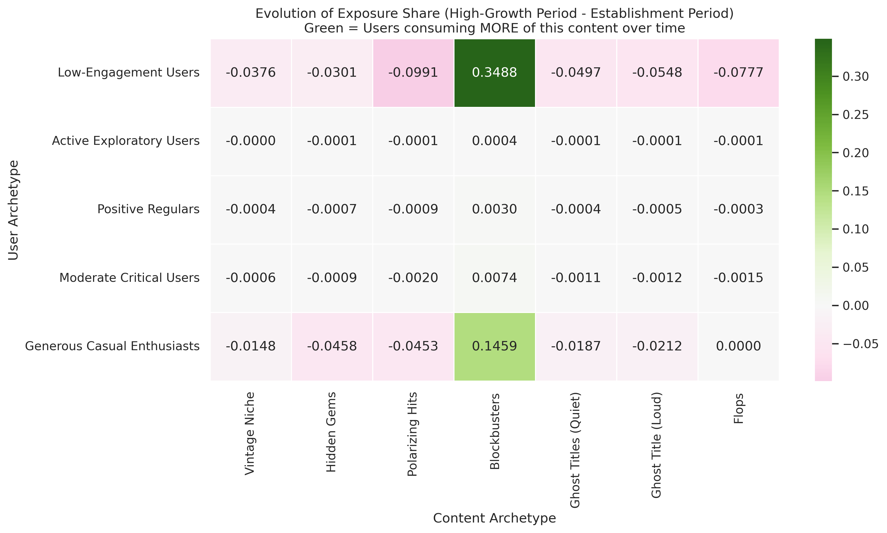
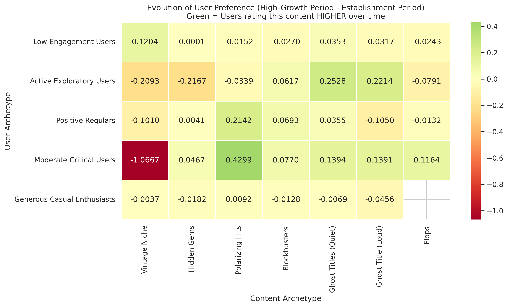
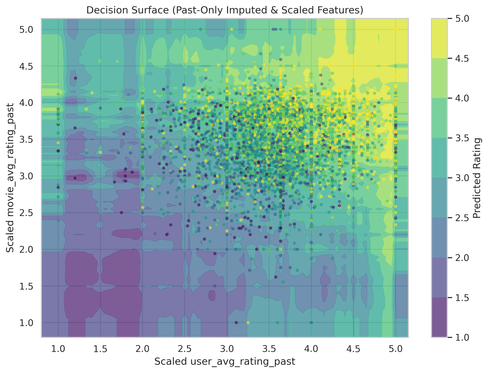

# Audience Decode: Behavioural Patterns in Streaming

Team Members: Rebecca Raible, Eleonora Ciufoli, Yara Messina, Mila Kirova

## 1. INTRODUCTION
This project analyzes the viewer_interactions.db dataset to uncover behavioural patterns within a large-scale streaming platform, moving beyond simple rating prediction to understand the underlying drivers of viewer engagement. 

Through dual-layer segmentation, we analyzed both the audience and content library through unsupervised methods like clustering. Allowing us to identified distinct behavioural personas, revealing that viewing patterns are not uniform; instead, users belong to specific segments that dictate how they interact with content. By analyzing how these user archetypes interact with different forms of content we were able to provide strategic insights for the platform to adopt in order to grow and provide targeted recommendations. 

Through a rigorous comparison of Linear Regression, Decision Trees, Random Forests, and Artificial Neural Networks (ANN), we evaluate whether these complex interactions between audience and content are better captured by interpretable linear trends or sophisticated non-linear dynamics.

## 2. METHODS
### 2.1 Data Overview
To prepare the raw interaction data for modelling, we implemented a rigorous pre-processing pipeline. The dataset was stored in a relational database consisting of multiple tables capturing different aspects of the system:
1.	`viewer_ratings`: individual ratings given by users to movies, including the rating value and the date of interaction.
2.	`user_statistics`: aggregated statistics describing user behaviour (e.g. average rating given by a user, number of ratings).
3.	`movie_statistics`: aggregated statistics describing movie popularity and reception (e.g. average movie rating, number of users who rated the movie).
4.	`movies`: metadata about movies, including movie_id, title, and year_of_release.

### 2.2 Exploratory Data Analysis (EDA)

### 2.3 Data Processing & Cleaning

### 2.4 Feature Engineering
Feature engineering focused on transforming raw, interaction-level data into interpretable behavioural representations at the user and content level. Both for our clustering and regression models, we engineered aggregated behavioural features including: 
1.	User-level statistics (e.g. average rating given by the user, rating variability)
2.	Movie-level statistics (e.g. average rating received by the movie, number of unique users)
3.	Optional temporal metadata (year_of_release)
4.	User-Content matrices (e.g preference and exposure matrices)
Identifiers such as `customer_id`, `movie_id`, and textual fields are excluded from the feature matrix, as they do not convey ordinal or numerical meaning useful for our prediction and could introduce noise. As well as redundant features such as `min_rating`/`max_rating` were dropped.

### 2.5 Modelling and Analysis Techniques
The modelling approach focuses on descriptive and explanatory techniques to uncover behavioural patterns in viewer engagement and content consumption, this was done through:

*	 **Clustering for audience and content segmentation**: clustering methods such as K-Means++, HDBSCAN and an autoencoder were used to identify groups with similar behavioural characteristics. User clustering captures differences in engagement intensity, rating strictness and activity duration whereas content clustering distinguishes items by popularity and audience reception patterns

*	 **Preference and exposure analysis**: aggregated user-content matrices were constructed to analyze how different audience segments interact with different content groups

*	 **Temporal analysis of behavioural change**: to study how preferences evolve from the platform’s establishment period to their high-growth period, interactions were partitioned into temporal segments and the difference in preferences across these periods were analyzed 

*	 **Individual rating prediction**: supervised learning techniques were trained to predict individual user ratings based on engineered behavioural and content features:
  * *Linear Regression (Baseline)*: provides immediate interpretability through coefficients, allowing us to quantify exactly how much a feature impacts the final rating
  * *Artificial Neural Network (Prediction)*: Multi-Layer Perceptron (MLP) using the Keras Sequential API with Dense layers and ReLU activation functions, utilized the Adam optimizer and Mean Squared Error loss
  * *Decision Tree Regression*: used due to its ability to capture non-linear relationships and its interpretability
  * *Random Forest Regressor*: employed as an ensemble extension of Decision Trees, aiming to reduce variance and improve generalization

  The models were trained using aggregated user-level and movie-level numerical features derived from the merged dataset.   Model hyperparameters such as tree depth, minimum number of samples per leaf, and number of estimators were selected to   balance model complexity and overfitting.

  

### 2.6 Environment and Reproducibility
*	Language: Python 3.10
*	Libraries: pandas/numpy/sqlite3 (data handing & manipulation), scikit-learn (Clustering, Trees, Regression, Imputation), tensorflow/keras (ANN architecture), matplotlib/seaborn (visualization).
*	Reproduction: Run pip install -r requirements.txt followed by the provided notebook.

## 3. EXPERIMENTAL DESIGN
**Experiment 1: Audience and Content Segmentation**
* Main Purpose: To identify groups of users and content with similar behavioural characteristics and assess whether segmentation reveals meaningful structure beyond individual interactions
* Baseline: Random cluster assignment and non-segmented aggregates
* Evaluation Metrics:
   * Silhouette score (cluster separation)
   * Cluster interpretability (feature distributions)

**Experiment 2: User–Content Preference and Exposure Analysis**
* Main Purpose: To analyze how different audience segments interact with different groups and to distinguish expressed preference from exposure-driven effects
* Baseline: Overall average ratings and interaction counts without segmentation
* Evaluation Metrics:
   * Differences in average ratings and interaction frequencies across user-content clusters were evaluated
   * Visual interpretability via heatmaps

**Experiment 3: Temporal Analysis of Preference Evolution**
* Main Purpose: To examine whether audience preferences change over time and whether thee changes differ across user segments
* Baseline: Static preference estimates computed over the full dataset
* Evaluation Metrics:
   * Change in average ratings between temporal segments (Δ preference)
   * Directional consistency across clusters and magnitude of preference evolution

**Experiment 4: Individual Rating Prediction**
* Main Purpose: To test the hypothesis that user ratings contain complex non-linear dependencies that a linear model cannot capture
* Baseline and Models Compared: Standard Linear Regression (OLS) was used as the baseline, more complex predictive models were then compared:
   * Decision Trees: three different models were tested by varying the maximum depth and the minimum number of samples per leaf to assess their impact on generalization.
   * Random Forests: three models were compared using different numbers of trees, depths, and leaf sizes.
   * Artificial Neural Network: to ensure robustness, we utilized Early Stopping to halt training automatically when validation loss ceased to improve, effectively preventing overfitting.
* Evaluation Metrics:
   * $RMSE$ (Root Mean Squared Error): The primary metric, chosen because it penalizes large errors heavily (e.g., predicting a 5-star movie as 1-star).
   * $MAE$ (Mean Absolute Error): Used to assess the average magnitude of error in "stars."
   * $R^2$ (Coefficient of Determination): Used to measure the proportion of variance in ratings explained by our features.

## 4. RESULTS
### 4.1 Main Findings
* **Audience segmentation reveals distinct behavioural archetypes:** clustering analysis identifies 5 differentiated viewer segments:
   * 🟦 Cluster 0 – Disengaged Low-Rating Users (≈11%)
   * 🟧 Cluster 1 – Highly Active Exploratory Viewers (≈27%)
   * 🟩 Cluster 2 – Consistent Positive Regulars (≈28%)
   * 🟥 Cluster 3 – Moderate but Critical Viewers (≈15%)
   * 🟪 Cluster 4 – Generous Casual Enthusiasts (≈19%)
 
   These results confirm that viewer behaviour on the platform is highly      heterogenous and cannot be captured by a single profile

  
* **Content segmentation highlights strong inequalities in visibility and quality:** reveals that a small group of Blockbusters (≈5%) dominate platform engagement alongside much larger clusters such as Hidden Gems. While Blockbusters dominate interactions, several less-exposed content clusters receive high ratings or strong user disagreement, suggesting untapped value in the long tail of the catalog.

* **Consumption patterns are largely driven by aggregate popularity rather than personalized matching:** exposure analysis shows an extreme concentration of user activity around Blockbusters across all user segments, whereas clusters like Hidden Gems, Vintage Niche and Ghost Titles receive negligible exposure despite strong preference signals.

* **Preference analysis reveals clear opportunities for personalization:** preference matrices demonstrate strong heterogeneity in tastes across all segments. For example, Hidden Gems receive consistently high ratings across all active user groups, while Blockbusters are rated critically by more selective users. These findings, indicate that recommendation strategies based only on popularity fail to align with segment-specific preferences.

* **Gap analysis exposes mismatches between exposure and satisfaction:** exposure-preference gap analysis reveals widespread under-exposure of high-quality content. Positive gaps for Hidden Gems appear across almost all active user segments while negative gaps for Blockbusters among critical and highly active users indicate oversaturation.

* **Temporal analysis shows a shift toward “safe” content with declining effectiveness:** Over time, the platform increasingly funnels users toward Blockbusters while exposure to niche and polarizing content declines across most segments. However, this shift doesn’t improve user satisfaction: ratings for Blockbusters stagnate or decrease among disengaged users.

* **Rating prediction is largely driven by historical user and movie behavior:** A linear regression model achieved solid baseline performance (R² ≈ 0.36, RMSE ≈ 0.87), showing that past averages explain much of the signal. More flexible models provide small but consistent gains. In particular, the ANN achieved the best overall accuracy, capturing weak non-linear patterns and slightly improving R² and RMSE. As predictive precision is prioritized over interpretability, the ANN was selected as the final model.

## 5. DISCUSSION AND CONCLUSIONS

The analysis reveals a clear mismatch between heterogeneous user preferences and largely uniform content exposure driven by aggregate popularity. Audience segmentation shows that distinct user groups value different types of content, while exposure patterns increasingly favor safe, mainstream titles, leading to systematic under-exposure of niche and high-quality content.

At the individual level, ratings are only partially predictable. Linear models capture the dominant historical signal, while more flexible models such as ANNs provide modest but consistent improvements by modeling weak non-linear patterns. As predictive precision is prioritized over interpretability, the ANN was selected as the final model.

Overall, the results suggest that the greatest opportunity for platform improvement lies in aligning content exposure with distinct audience segments and evolving user preferences. Segment-aware recommendation strategies can improve user satisfaction while supporting content diversity and long-tail discovery.

## 6. FUTURE DIRECTIONS

The current model relies heavily on aggregate statistics, which introduces a "cold start" problem for new users. Future work should focus on:
* **Content-Based Filtering:** Incorporating Natural Language Processing (NLP) of movie descriptions and metadata to predict ratings for new content where historical data is sparse.
* **Temporal Dynamics:** shifting from static prediction to sequential modelling using Recurrent Neural Networks (RNNs) to capture how user preferences and rating standards evolve over time.
* **Hybrid Recommendation Strategies:** future work could combine collaborative filtering, content-based signals, and segmentation-driven rules into a hybrid system. Such an approach could leverage the strengths of each method to improve recommendations for both active users and cold-start scenarios.

